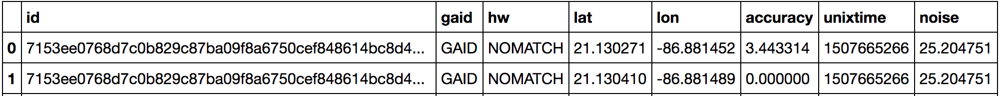
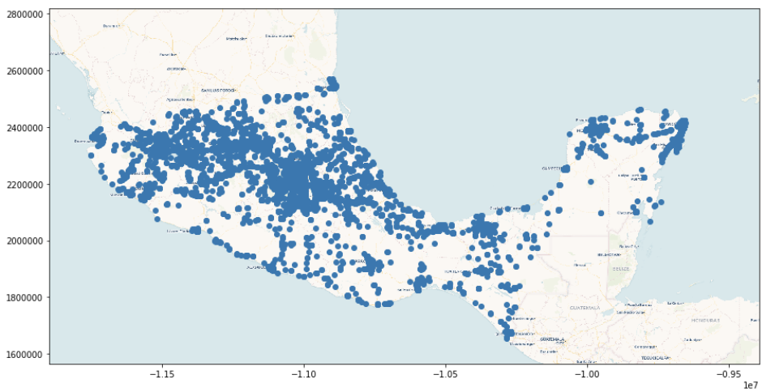

# Mobility data analysis in Python

mobility4resilience is a library for disaster risk management applications of smartphone location data. It provides functions for:
* loading and cleaning GPS datasets;
* extracting home and work locations;
* point of interest visit analysis;
* analysis of population displacement and recovery rates.

## Background
This library responds to the need for policy insights for preparedness and response to natural disasters, leveraging the growing availability of large GPS datasets depicting human movements before, during, and after such events. It provides functions to create data-informed policy insights relevant for different stages of the disater risk management cycle: from estimating population displacement and return, to long-term disaster resilience planning premised on mobility patterns.


## Requirements
* **Dependencies.** The library uses the scientific Python stack (numpy, Pandas, Geopandas) and relies on Dask for distributed processing of large datasets.
* **Data.** Data is assumed to include `lon`, `lat`, `date` and `UserID` columns.

## Examples
Use of the library is illustrated with a case study from the Septemnber 2017 Puebla earthquake (see *Example notebooks*).

## Quick start

```python
from d4r_toolkit import data_preprocess, home_est, viz, utils
colnames = ["id","gaid","hw","lat","lon","accuracy","unixtime","noise"]
ddf = data_preprocess.loaddata(filepath, ",", colnames, "")
ddf.head(2)
```

<!--  -->

```python
ddf_sample = ddf.sample(frac=0.0001).compute()
viz.visualize_simpleplot(ddf_sample)
```



## Acknowledgements
The library was developed under a grant from the Spanish Fund for Latin America and the Caribbean (SFLAC) under the Disruptive Technologies for Development (DT4D) initiative at the World Bank. Thanks to Cuebiq Inc, Purdue University and Mind Earth for their collaboration.
